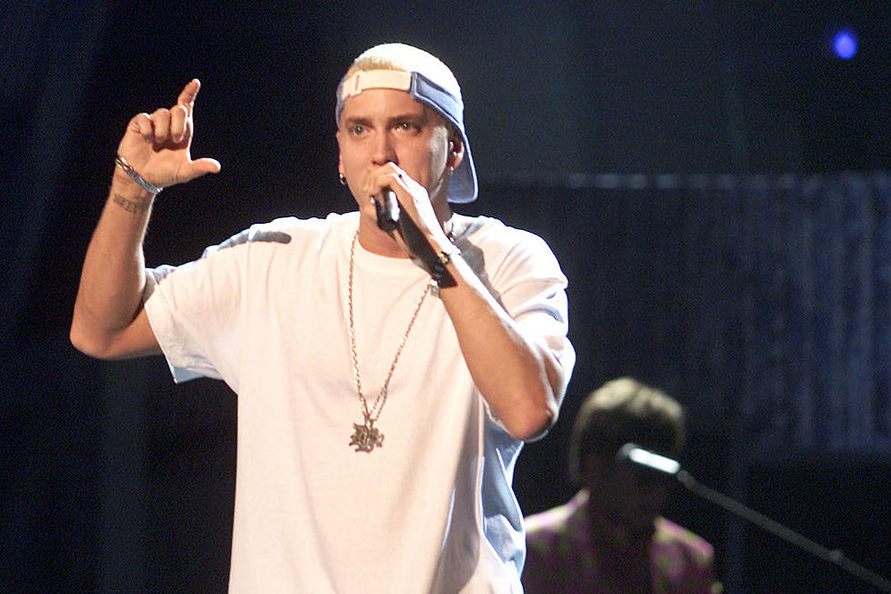

> In this "Data Story", we will use `processed_lyrics_lc.RData` dataset (generate by using `Text_Processing_lc.Rmd` file, which is different from the tutorial one and processing data more accurately than tutorial one) and `artists.csv` dataset. We add some new columns such as decade (1970s, 1980s, 1990s and etc.), category (band and single). <br> 
There are three parts, the first part is basic analysis. <br> 
1. In the first part, we will analyze our datasets and visualize basic information about our datasets. <br>
2. The second part will use lexicons in `textdata` package and do some sentimental analysis. <br>
3. In the Third part, we will take a look at `cleanNLP` package. <br>


# Load Pakages and Processed Datasets
```{r}
knitr::opts_chunk$set(comment = NA)
```

**Load libraries**
```{r}
library("textdata")
library("dplyr")
library("tidytext")
library("forcats")
library("ggplot2")
library("formattable")
library("kableExtra")
library("tidyr")
library("circlize")
library("wordcloud2")
library("plotrix")
library("stringr")
library("cleanNLP")
library("udpipe")
library("networkD3")
```

**load processed_lyrics_lc.RData**<br>
I wrote Text_Processing_lc.Rmd file which is based on Text_Processing.Rmd to generate processed_lyrics_lc.RData. <br>
Processed lyrics are saved in "stemmedwords" column. 

```{r}
artistsData <- read.csv('../data/artists.csv')
artistsData$Artist <- gsub("-", " ", artistsData$Artist)

load('../output/processed_lyrics_lc.RData')
dt_lyrics$song <- gsub("-", " ", dt_lyrics$song)
dt_lyrics$artist <- gsub("-", " ", dt_lyrics$artist)

dt_lyrics <- dt_lyrics %>%
  mutate(decade = 
           ifelse(dt_lyrics$year %in% 112:1969, "before 1970s",
           ifelse(dt_lyrics$year %in% 1970:1979, "1970s", 
           ifelse(dt_lyrics$year %in% 1980:1989, "1980s", 
           ifelse(dt_lyrics$year %in% 1990:1999, "1990s", 
           ifelse(dt_lyrics$year %in% 2000:2009, "2000s", 
           ifelse(dt_lyrics$year %in% 2010:2019, "2010s", 
                  "NA")))))))

sum(is.na(artistsData$Members))
artistsData <- artistsData %>% mutate(Category = ifelse(grepl(",", artistsData$Members), "band", "single"))
dt_lyrics <- merge(dt_lyrics, artistsData, by.x = "artist", by.y = "Artist")

lyrics_words_filtered <- dt_lyrics %>% unnest_tokens(word, stemmedwords)
```

---

# Basic Analysis 
## Artist 
### Basic Information
There are 2535 artists and 125501 songs in our dataset. <br>
```{r}
print(length(unique(dt_lyrics$artist)))
df <- dt_lyrics %>% group_by(artist) %>% summarise(song_count = length(unique(song)))
print(sum(df$song_count))
```

This wordcloud gives us a basic view of artists and songs. 
```{r}
song_artist <- dt_lyrics %>% group_by(artist) %>% summarise(song_count = length(unique(song))) %>% arrange(desc(song_count)) 
song_artist$Category <- merge(song_artist, artistsData, by.x = "artist", by.y = "Artist")$Category
wordcloud2(song_artist[1:800, ], size = .5, color = 'random-light')
```

```{r}
# songs_by_year <- dt_lyrics %>% group_by(year) %>% count(year, year)
# dt_lyrics$song_count <- merge(dt_lyrics, songs_by_year, by.x = "year", by.y = "year")
# df <- as.data.frame(dt_lyrics)
# sankeyNetwork(Links = df, Nodes = df, Source ="song",
# Target = "decade", Value = "song_count", NodeID = "id",
# units = "TWh", fontSize = 12, nodeWidth = 30)
```


### Artists with Highest Song Count
We list artists with highest song count in the table below. <br> 
Dolly Parton gets the highest song count which is up to 717. In addition, we divide our artists to two groups, one is "band' and the other is "single". We also display this information in our table. It seems that the category doesn't influence the output. 
```{r}
song_artist[1:10,] %>%
  ungroup(artist, song_count) %>%
  mutate(song_count = cell_spec(
    song_count, color = "white", bold = T,
    background = spec_color(1:10, end = 0.9, option = "A", direction = 1)),
    Category = cell_spec(
    Category, color = "white", bold = T,
    background = factor(Category, c("band", "single"), c("lightblue", "lightpink")))) %>%
  kable("html", escape = FALSE, align = "c", caption = "Artists with Highest Song Count") %>%
  kable_styling(bootstrap_options = 
                  c("striped", "condensed", "bordered"), 
                full_width = FALSE)
```

### "Band" or 'Single"?
To my surprise, the difference between songs from "band" and songs from "single" is not that enormous. 43% of our songs are from bands and the rest of songs are indie musicians.  
```{r}
df <- song_artist %>% group_by(Category) %>% summarise(sum_songs = sum(song_count))

lbls <- df$Category
slices <- df$sum_songs
pct <- round(slices/sum(slices)*100)
lbls <- paste(lbls, pct)
lbls <- paste(lbls,"%",sep="") 
pie3D(slices,labels = lbls,explode=0.1, col=c("lightblue", "lightpink"),
   main="Pie Chart of Band and Single")
```


## Lyrics
### Lyrics per Song 
We rank the length of songs and plot the last 10 and top 10. <br>
In this division, we use the original lyrics (not the stemmedwords). We can conlude that "I'm your bass creator" is shortest with around 175 words, while "Yes sir I will" contains around 35,000 words. 
```{r}
dt_lyrics$lyrics_number <- nchar(str_replace_all(dt_lyrics$lyrics, "[\r\n]" , ""))
df <- dt_lyrics[order(dt_lyrics$lyrics_number),]

ggplot(head(df, n = 10), aes(x = factor(song,levels=song),  y = lyrics_number)) + geom_col(fill="lightblue",size=1) + theme_bw() + theme(axis.text.x = element_text(angle = 90, hjust = 1)) + 
  labs(x="song",y="word count", title = "Last 10 Words per song") + theme(plot.title = element_text(hjust = 0.5))

ggplot(tail(df, n = 10), aes(x = factor(song,levels=song),  y = lyrics_number)) + geom_col(fill="coral",size=1) + theme_bw() + theme(axis.text.x = element_text(angle = 90, hjust = 1)) + 
  labs(x="song",y="word count", title = "Top 10 Words per song") + theme(plot.title = element_text(hjust = 0.5))
```

### Popular Words in Lyrics
"love", "time", "baby", "day" and "life" are the most popular words among artists. 
```{r}
library("tidytext")
lyrics_words_filtered %>%
  count(word, sort = TRUE) %>%
  top_n(20) %>%
  ungroup() %>%
  mutate(word = reorder(word, n)) %>%
  ggplot() +
    geom_col(aes(word, n), fill = "lightgreen") +
    theme(legend.position = "none",
          panel.grid.major = element_blank()) +
    xlab("") + 
    ylab("Song Count") +
    ggtitle("Most Frequently Used Words in Lyrics") +
    coord_flip() + theme_bw() + theme(plot.title = element_text(hjust = 0.5))
```

There is a wordcloud to visualize the popular words. 
```{r}
lyrics_words_counts <- lyrics_words_filtered %>%
  count(word, sort = TRUE)
wordcloud2(lyrics_words_counts[1:800, ], size = 1.5, color = "random-light")
```

#### Popular Words by Decades
Let's dig deeper into the popular words. We group the songs by year. We analyze them in different decades. We can find that "Love", "time", "baby" are timeless. They are always very popular in the 50 years. 
```{r}
popular_words <- lyrics_words_filtered %>%
  group_by(decade) %>%
  count(word, decade, sort = TRUE) %>%
  slice(seq_len(8)) %>%
  ungroup() %>%
  arrange(decade,n) %>%
  mutate(row = row_number())

popular_words %>%
  ggplot(aes(row, n, fill = decade)) +
    geom_col(show.legend = NULL) +
    labs(x = NULL, y = "Word Count") +
    ggtitle("Popular words by decade") +  
    facet_wrap(~decade, scales = "free") +
    scale_x_continuous(  
      breaks = popular_words$row, 
      labels = popular_words$word) +
    coord_flip() + theme_bw() + theme(plot.title = element_text(hjust = 0.5))
```

### TF-IDF analysis 
In this section, we use TF-IDF analysis to represent the information behind a word in a document relating to some outcome of interest. Tf-idf stands for term frequency-inverse document frequency, and the tf-idf weight is a weight often used in information retrieval and text mining. <br>
TF: term frequency, IDF is inverse document frequency <br>
TF-IDF = TF * IDF <br>
```{r}
popular_tfidf_words <- lyrics_words_filtered %>%
  distinct() %>%
  filter(nchar(word) > 3) %>%
  count(decade, word, sort = TRUE) %>%
  ungroup() %>%
  bind_tf_idf(word, decade, n)

head(popular_tfidf_words)
```

**TF-IDF across time** <br>
We can discover that "life", "eyes", "heart" are always important among these years. ("before 1970s" has very limited data, we can ignore it.)
```{r}
top_popular_tfidf_words <- popular_tfidf_words %>%
  arrange(desc(tf_idf)) %>%
  mutate(word = factor(word, levels = rev(unique(word)))) %>%
  group_by(decade) %>% 
  slice(seq_len(8)) %>%
  ungroup() %>%
  arrange(decade, tf_idf) %>%
  mutate(row = row_number())

top_popular_tfidf_words %>%
  ggplot(aes(x = row, tf_idf, 
             fill = decade)) +
    geom_col(show.legend = NULL) +
    labs(x = NULL, y = "TF-IDF") + 
    ggtitle("Important words using TF-IDF by decades") +  
    facet_wrap(~decade, ncol = 3, scales = "free") +
    scale_x_continuous(  # This handles replacement of row 
      breaks = top_popular_tfidf_words$row, # notice need to reuse data frame
      labels = top_popular_tfidf_words$word) + theme_bw() + coord_flip() + 
  theme(plot.title = element_text(hjust = 0.5))
```

## Distribution of Length <br>
In this section, we plot the distributions of word length and song length. 

### Distribution of Word Length  
```{r}
#unnest and remove undesirable words, but leave in stop and short words
lyrics_word_lengths <- lyrics_words_filtered %>%
  group_by(song,decade) %>%
  distinct() %>%
  mutate(word_length = nchar(word)) 

lyrics_word_lengths %>%
  count(word_length, sort = TRUE) %>%
  ggplot(aes(word_length), 
         binwidth = 10) + 
    geom_histogram(aes(fill = ..count..),
                   breaks = seq(1,25, by = 2), 
                   show.legend = FALSE) + 
    xlab("Word Length (Character Count)") + 
    ylab("Word Count") +
    ggtitle("Distribution of Word Length ") +
    theme(plot.title = element_text(hjust = 0.5),
          panel.grid.minor = element_blank()) + theme_bw() + theme(plot.title = element_text(hjust = 0.5))
```

### Distribution of Song Length 
```{r}
dt_lyrics$len <- str_count(dt_lyrics$stemmedwords)
dt_lyrics %>%
  ggplot(aes(x = len)) +    
  geom_histogram(fill= "coral",bins = 100) +
  labs(x= 'Song Length (Word Count)',y = 'Song Count', title = 'Distribution of Song Length') + theme_bw()
```


# Sentimental Analysis
## Compare Different Lexicons
### Word Counts in Three Lexicons
In this section, we use `tidytext` package, a wondeful package to do text mining and sentiment analysis.  <br>
`get_sentiments` function in `tidytext` package provides four lexicons -- "afinn", "bing", "loughran", "nrc". However, we will not analyze "loughran" lexicon which is best suited for financial text. 

```{r}
df_nrc <- get_sentiments("nrc") %>% mutate(lexicon = "nrc") 
df_bing <- get_sentiments("bing") %>% mutate(lexicon = "bing")
df_afinn <- get_sentiments("afinn") %>% mutate(lexicon = "afinn", value = ifelse(value >= 0, "positive", "negative"))%>% 
  rename("sentiment" = "value")
df_lexicons <- rbind(df_nrc, df_bing, df_afinn)

new_sentiments <- df_lexicons %>%
  group_by(lexicon) %>%
  mutate(words_in_lexicon = n_distinct(word)) %>%
  ungroup()

new_sentiments %>%
  group_by(lexicon, sentiment, words_in_lexicon) %>%
  summarise(distinct_words = n_distinct(word)) %>%
  ungroup() %>%
  spread(sentiment, distinct_words) %>%
  mutate(lexicon = color_tile("lightblue", "lightblue")(lexicon),
         words_in_lexicon = color_bar("lightgreen")(words_in_lexicon), 
         negative = color_bar("lightpink")(negative), 
         positive = color_bar("lightpink")(positive)) %>%
  kable("html", escape = FALSE, align = "c", caption = "Word Counts in Three Lexicons") %>%
  kable_styling(bootstrap_options = 
                  c("striped", "condensed", "bordered"), 
                full_width = FALSE) 
```

### Match Ratio in Three Lexicons
From the table below, we can observe that NRC lexicon has the highest match ratio, ~0.03996 and AFINN lexicon has the lowest match ratio, ~0.01091. 
```{r}
lyrics_words_filtered %>%
  mutate(words_in_lyrics = n_distinct(word)) %>%
  inner_join(new_sentiments) %>%
  group_by(lexicon, words_in_lyrics, words_in_lexicon) %>%
  summarise(match_words = n_distinct(word)) %>%
  ungroup() %>%
  mutate(total_match_words = sum(match_words), #Not used but good to have
         match_ratio = match_words / words_in_lyrics) %>%
  select(lexicon, match_words, match_ratio) %>%
  mutate(lexicon = color_tile("lightblue", "lightblue")(lexicon), 
         match_ratio = cell_spec(
    match_ratio, color = "white", bold = T,
    background = spec_color(1:3, begin = 0.7, end = 0.9, option = "A", direction = -1))) %>%
  kable("html", escape = FALSE, align = "c", caption = "Match Ratio in Three Lexicons") %>%
  kable_styling(bootstrap_options = 
                  c("striped", "condensed", "bordered"), 
                full_width = FALSE)
```

## NRC Lexicon 
### Introduction to NRC lexicon 
In the previous section, we observed that NRC has highest match ratio and then we choose NRC Lexicon to analyze deeply in this section:  <br> 
NRC lexicon has 10 categories of sentiment:anger, anticipation, disgust, fear, joy, negative, positive, sadness, surprise, trust. <br>
Firstly, let's look at the NRC lexicon. Take "abandon" for an example, "abandon" has three labels -- "fear", "negative", "sadness". Each word in NRC lexicon has one or multiple labels. <br>
```{r}
head(get_sentiments("nrc"))
```

As the figure shown below, "negative" category has the largest amount of words, "surprise" category has the smallest amount of words.   
```{r}
sentiment_counts <- get_sentiments("nrc") %>% 
  count(sentiment) %>% 
  mutate(sentiment2 = fct_reorder(sentiment, n))
# visualization 
ggplot(sentiment_counts, aes(x = sentiment2, y = n)) +
  geom_col(fill="palegreen3") + 
  labs(
    title = "Sentiment Counts in NRC Lexicon",
    x = "Sentiment",
    y = "Counts"
  ) + theme_bw() + theme(plot.title = element_text(hjust = 0.5))
```


> Then we use NRC lexicon to analyze our lyrics dataset. 

### Words in sentiments
In this section, we curious about the top 8 words in each sentiment category. From the figure below, it seems that "feeling" is in every category. 
```{r}
lyric_sentiment <- lyrics_words_filtered %>% inner_join(get_sentiments("nrc"), by = "word")
lyric_sentiment %>% count(word,sentiment, sort = TRUE) %>% group_by(sentiment) %>% top_n(n = 8) %>% ungroup() %>%
ggplot(aes(x = reorder(word, n),y = n,fill = sentiment)) + geom_col(show.legend = FALSE) + facet_wrap(~sentiment,scales = "free") + coord_flip() + theme_bw() +  
  labs(
    x = "Counts",
    y = "Word"
  ) + theme(text = element_text(size = 8), axis.text.x = element_text(angle = 90, hjust = 1)) 
```

### Artists in Sentiments 
It's quite interesting that artist Eminem wrote most negative and most positive songs.

```{r}
lyric_sentiment %>% count(artist,sentiment,sort = TRUE) %>% group_by(sentiment) %>% 
top_n(n = 8) %>% ggplot(aes(x = reorder(artist, n),y = n,fill = sentiment)) + geom_bar(stat="identity",show.legend = FALSE) + facet_wrap(~sentiment,scales = "free") + coord_flip() + 
  theme_bw() +  
  labs(
    x = "Song",
    y = "how many words in one sentiment category"
  ) + theme(text = element_text(size = 8), axis.text.x = element_text(angle = 90, hjust = 1)) 
```

### Songs in Sentiments 
We can also anlyze songs in different sentiments. As figure shown below, "Silence Night" is the most positive song and "War" is the most negative. 
```{r}
lyric_sentiment %>% count(song,sentiment,sort = TRUE) %>% group_by(sentiment) %>% 
top_n(n = 8) %>% ggplot(aes(x = reorder(song, n),y = n,fill = sentiment)) + geom_bar(stat="identity",show.legend = FALSE) + facet_wrap(~sentiment,scales = "free") + coord_flip() + 
  theme_bw() +  
  labs(
    x = "Song",
    y = "how many words in one sentiment category"
  ) + theme(text = element_text(size = 8), axis.text.x = element_text(angle = 90, hjust = 1)) 
```

### Decades in Sentiments 
```{r}
grid.col = c("before 1970s" = "orange", "1980s" = "lightpink", "1990s" = "lightgreen", "2000s" = "lightblue", "2010s" = "coral", "anger" = "grey", "anticipation" = "grey", "disgust" = "grey", "fear" = "grey", "joy" = "grey", "sadness" = "grey", "surprise" = "grey", "trust" = "grey", "negative" = "grey", "positive" = "grey")

decade_sentiment <-  lyric_sentiment %>%
  count(sentiment, decade) %>%
  group_by(decade, sentiment) %>%
  summarise(sentiment_sum = sum(n)) %>%
  ungroup()

circos.clear()
circos.par(gap.after = c(rep(2, length(unique(decade_sentiment[[1]])) - 1), 10,
                         rep(2, length(unique(decade_sentiment[[2]])) - 1), 10))
chordDiagram(decade_sentiment, grid.col = grid.col, annotationTrack = "grid")
circos.track(track.index = 1, panel.fun = function(x, y) {
    circos.text(CELL_META$xcenter, CELL_META$ylim[1], CELL_META$sector.index, 
        facing = "clockwise", niceFacing = TRUE, adj = c(0, 0.5), cex = 0.5)
}, bg.border = NA) # here set bg.border to NA is important
title("Relationship Between Sentiment and Decade")
```

Since the number of words is imbalanced in different decades as the figure shown above, we will compute the ratio. <br> 
The bar charts show that songs written in 1970s (we ignore songs before 1970s) are most positive and songs written in 2000s decade are most negative. 
```{r}
df_1 <- lyric_sentiment %>% count(decade, sentiment, sort = TRUE) %>% group_by(sentiment)
df_2 <- lyric_sentiment %>% count(decade, sort = TRUE) %>% group_by(decade)
df_3 <- merge(df_1, df_2, by.x = "decade", by.y = "decade") %>% mutate(ratio = n.x/n.y)
df_3 %>% ggplot(aes(x = reorder(decade, ratio),y = ratio,fill = sentiment)) + geom_bar(stat="identity",show.legend = FALSE) + facet_wrap(~sentiment,scales = "free") + coord_flip() + 
  theme_bw() +  
  labs(
    x = "Song",
    y = "Ratio"
  ) + theme(text = element_text(size = 8), axis.text.x = element_text(angle = 90, hjust = 1))
```

# NLP
We will take a look at `cleanNLP` package. <br>
The `cleanNLP` package is designed to make it as painless as possible to turn raw text into feature-rich data frames. <br>
```{r}
## Annotate the text, please comment out this chunk if you want to reproduce this section. It will be time-consuming (couple of hours).

# cnlp_init_udpipe()
# anno <- cnlp_annotate(dt_lyrics$stemmedwords)
# saveRDS(anno, file = "../output/anno.rds")
# save(anno, file = "../output/anno.RData")
load("../output/anno.RData")
output <- cnlp_get_token(anno)
```

A view of our table. 
```{r}
head(output)
```

This table shows us the number of words that belong to different part-of-speech. (some words may be labeled multiple times.)
```{r}
table(output$upos)  %>%
  kable("html", escape = FALSE, align = "c") %>%
  kable_styling(bootstrap_options = 
                  c("striped", "condensed", "bordered"), 
                full_width = FALSE)
```

# Conclusion 
In this "Data Story", we processed and analyzed song lyrics. There are several interesting findings: <br>
1. “Love”, “time”, “baby” are timeless. They are always very popular in the past 50 years. <br>
2. “life”, “eyes”, “heart” are always important among these years. <br>
3. Songs written in 1970s (we ignore songs before 1970s) are most positive and songs written in 2000s decade are most negative. This may be related to the events of that year. We can verify our hypothesis by introducing other datasets. <br>


# References
[1] https://www.tidytextmining.com/sentiment.html <br>
[2] https://statsmaths.github.io/blog/cleanNLP2-quickstart/ <br>
[3] https://www.datacamp.com/community/tutorials/sentiment-analysis-R#lexiconsandlyrics <br>
[4] https://www.kaggle.com/devisangeetha/sing-a-song-lyrics-is-here <br> 


